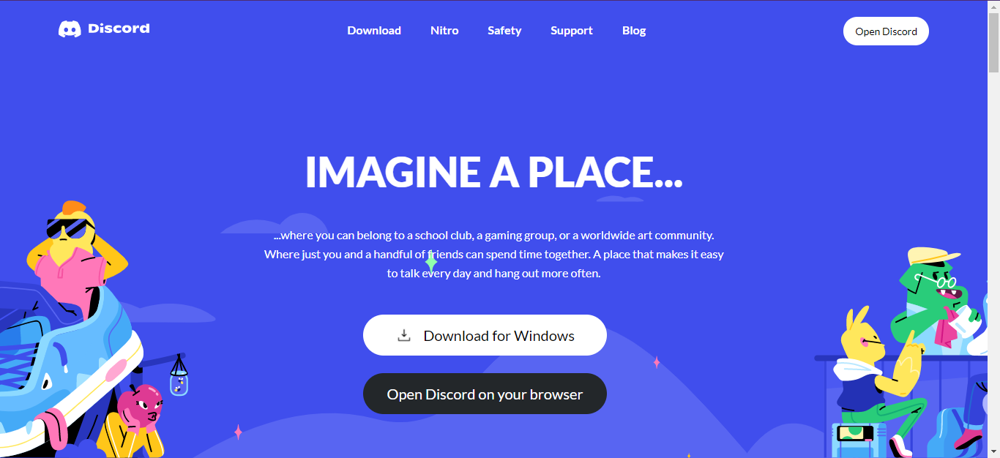

# Discord Clone

I tried to clone Discord design with HTML and CSS just to make my hands dirty with design basics as a backend developer.

 

 
 
 

Live version : [demo](https://discord-design-clone.netlify.app/)
